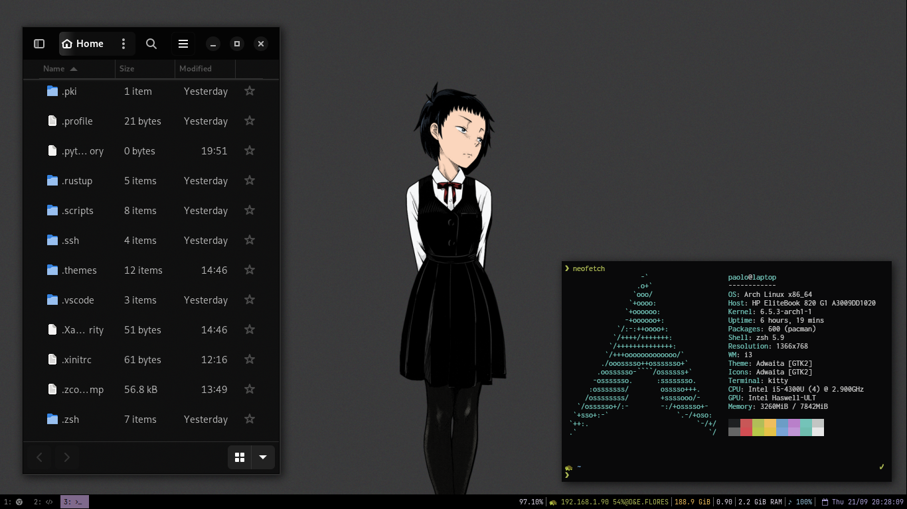

# dotfiles

For Arch, I basically replicate my Debian setup functionality and tools.



| programs      | using            |
| ------------- | ---------------- |
| wm            | i3               |
| os            | Arch Linux       |
| terminal      | kitty            |
| shell         | zsh + p10k       |
| compositor    | picom            |
| launcher      | rofi             |
| screen locker | betterlockscreen |
| status bar    | i3status         |

## Setup

Read the [Arch installation guide](https://wiki.archlinux.org/title/installation_guide).

On a fresh Arch Linux installation, setup a graphical user interface:

See <https://wiki.archlinux.org/title/Xorg>

```sh
sudo pacman -S xorg xorg-server xorg-xinit
```

Install the i3 meta package. See the [wiki entry for i3](https://wiki.archlinux.org/title/i3).

```sh
sudo pacman -S i3
```

Now install the dependencies (with paru as AUR helper)

```sh
paru -S rofi kitty zsh lsd xclip picom-git feh polkit-gnome gnome-keyring \
wireless_tools jq xdotool alsa-utils pulseaudio playerctl bat flameshot nemo \
nemo-fileroller gthumb bat locate gitin
```

Symbolic links for root:

```sh
sudo ln -s -f ~/.zsh /root/.zsh
sudo ln -s -f ~/.p10k.zsh /root/.p10k.zsh
sudo ln -s -f ~/.config/powerlevel10k /root/.config/powerlevel10k
sudo ln -s -f ~/.dotfiles/etc/keyd/default.conf /etc/keyd/default.conf
```

Some fixes I needed to do:

```sh
# The Gnome keyring prompt was not showing up:
echo "dbus-update-activation-environment --systemd DISPLAY" >> ~/.xinitrc
```

And choose a web browser.

```sh
# Firefox
sudo pacman -S firefox
# Chromium
sudo pacman -S chromium
# Chrome
sudo pacman -S google-chrome
# etc
```

Install the GTK theme

```sh
mkdir ~/repos && cd ~/repos
git clone --depth=1 https://github.com/vinceliuice/Colloid-gtk-theme
**./install.sh --color dark --theme grey --tweaks normal black
cp -r ~/.themes/Colloid-Grey-Dark/gtk-4.0/* ~/.config/gtk-4.0/**
```

Then install the dotfiles (see the [setup script](https://github.com/paoloose/dotfiles/blob/main/.scripts/setup.sh))

```sh
curl -s https://raw.githubusercontent.com/paoloose/dotfiles/main/.scripts/setup.sh | bash
```

Start the X session with `startx` and you should be good to go.

Thinks you might want to configure:

- A session manager, I recommend [lightdm](https://wiki.debian.org/LightDM).
- A file manager like [thunar](https://wiki.debian.org/Thunar).
- A network manager like [nm-applet](https://wiki.debian.org/NetworkManager).
- The bluetooth, see [this](https://wiki.debian.org/BluetoothUser).
- Your mouse sensitivity, see [this](https://askubuntu.com/a/1051759).
- Your keyboard layout:

  ```sh
  localectl list-x11-keymap-layouts # to see available layouts
  localectl list-x11-keymap-variants <layout> # available variants
  localectl set-x11-keymap <layout>
  localectl set-x11-keymap <layout> <variant>
  ```

- A lock screen, I use [betterlockscreen](https://github.com/betterlockscreen/betterlockscreen#installation)
  as a *better* replacement for i3lock.

- The recommended packages (firmware) for your hardware.

  - For nvidia, see [Nvidia Drivers for Debian](https://wiki.debian.org/NvidiaGraphicsDrivers).
  - For other such as AMD see [Debian graphics card](https://wiki.debian.org/GraphicsCard).

## How to create your own dotfiles repo

See [this](https://news.ycombinator.com/item?id=11070797) for more info.

```bash
# In your home directory

# Create your dotfiles repo as a bare repo

mkdir .dotfiles
git init --bare ./.dotfiles

# Create an alias for working on it

alias dotfiles='/usr/bin/git --work-tree=$HOME --git-dir=$HOME/.dotfiles'

# or make a global alias
echo alias dotfiles='/usr/bin/git --work-tree=$HOME --git-dir=$HOME/.dotfiles' >> ~/.zshrc # or ~/.bashrc

# Use the alias whenever you want to interact with your new repo
dotfiles config --local status.showUntrackedFiles no
dotfiles branch -M main

# Link the repo to a remote git repository
dotfiles remote add origin <repo-url>
```

Usage

```bash
# In your home directory
dotfiles add .somefile
dotfiles status
dotfiles commit -m 'add .somefile'
dotfiles push origin main
```

## Inspiration

Awesome repos that I've used as inspiration:

- <https://github.com/addy-dclxvi/i3-starterpack>
- <https://github.com/adi1090x/rofi>
