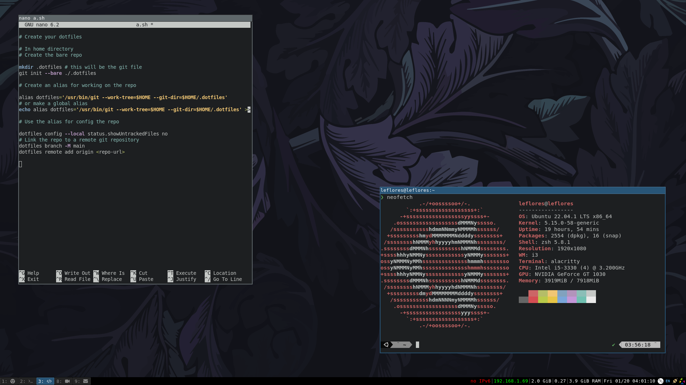

# dotfiles

Repo for my dotfiles. Currently using [i3wm](https://i3wm.org/) and its native modules (i3bar, i3status, i3lock, etc). With [rofi](https://davatorium.github.io/rofi/) as application launcher.



Terminal: [alacritty](https://alacritty.org/) with ([zsh](https://www.zsh.org/) + [oh-my-zsh](https://ohmyz.sh/) + [powerlevel10k](https://github.com/romkatv/powerlevel10k)) as shell.

## Setup

See `.scripts/setup.sh` for setup for new environments.


## How to create your own dotfiles repo

Small guide here. See [this](https://news.ycombinator.com/item?id=11070797) for more info.

```bash
# In your home directory

# Create the bare repo
mkdir .dotfiles
git init --bare ./.dotfiles

# Create an alias for working on the repo

alias dotfiles='/usr/bin/git --work-tree=$HOME --git-dir=$HOME/.dotfiles'
# or make a global alias
echo alias dotfiles='/usr/bin/git --work-tree=$HOME --git-dir=$HOME/.dotfiles' >> ~/.zshrc # or ~/.bashrc

# Use the alias to configure the repo

dotfiles config --local status.showUntrackedFiles no
# Link the repo to a remote git repository
dotfiles branch -M main
dotfiles remote add origin <repo-url>
```

Usage

```bash
# In your home directory
dotfiles add .somefile
dotfiles status
dotfiles commit -m 'add somefile'
dotfiles push origin main
```
